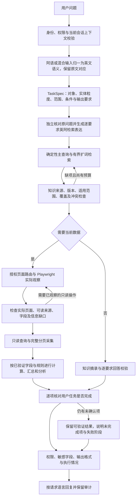

# 通用 Agent：跨语言检索与逐阶段质检

## 1. 流程

代码负责语言处理、执行能力、约束检查和恢复预算。页面含义、业务别名、状态规则、字段绑定及计算口径仍来自适用的页面知识。扩词不授予接口权限，也不替代页面证据。

## 2. 跨语言处理

1. 阿语或混合输入在 TaskSpec 之前进行英文语义归一。原文引用必须顺序覆盖全文，检查数字、日期和标识符，原始问题始终保留。
2. TaskSpec 使用英文语义字段。实际编号、名称和筛选值保持原值。部门、对象和管理范围不能只出现在搜索词中。
   原始问题和英文归一问题传递到所有规划阶段，供检查 TaskSpec 是否漏项。当统计粒度误用了分组维度，且各统计项明确指向同一实体时，可校正粒度并记录依据；实体不明确时不自动猜测。
3. QueryExpansion 独立对照原问题及已绑定的历史意图。漏项时最多修正一次任务，再次审查；每个任务要求必须有对应的英阿检索表达。
4. 主查询由 TaskSpec 确定性生成。自由搜索词作为补充查询保留，避免同一任务因不同语言的措辞后缀改变主查询。
5. 扩词最多两条，计入现有检索预算。前置扩词仅接受翻译和词形变化，不自动应用模型猜测的业务近义词。业务等价关系仍需知识库证实。
6. 阿语字母、附标及数字归一用于词项匹配，不改写真实数据值。不同阿语概念不能因词项都被删除而错误匹配。
7. 查询结果按查询排名融合，再按文档分散保留。页面字段查询保留已经发现的页面定位信息；覆盖补查保持聚焦，不附加整份任务。

首轮查询出现通道不完整时，可尝试受约束的备用查询。备用查询必须独立通过同样的通道检查，不能把多个查询的部分通道合并为成功。权限拒绝不触发扩词绕行。全部候选仍失败时返回错误，并记录实际执行的查询。

## 3. 质检与恢复

| 阶段 | 检查内容 | 未通过后的处理 |
| --- | --- | --- |
| 身份与上下文 | 当前身份、权限、目录、历史指纹、澄清有效性 | 拒绝混用上下文，保留真实依赖错误 |
| 问题解析 | 原文覆盖、数字及编号、统计实体与分组维度、独立统计条件 | 有界纠错，不猜业务规则 |
| 跨语言扩词 | 要求逐项对应、来源文本、数字、标识符、禁止猜页面 | 原问题漏项可修正一次，再次审查 |
| 知识检索 | 实际通道、授权目录、文档状态、版本及补查失败 | 有界扩词与补读，失败记录保留 |
| 知识覆盖 | 每个要求是否有适用证据，定义是否冲突 | 补查后独立复核，未确认项不升级为通过 |
| 页面路由 | 授权目录、知识引用、对象范围、前置记录定位 | 证据不足可降为只读观察，不跳过权限 |
| 页面读取 | 实际路径、观察结果、可读来源 | 有界重读或路由恢复 |
| 来源选择 | 来源确已观察、已获准、字段形态与引用有效 | 纠正规划或执行已观察的只读操作 |
| 数据采集 | 分页、实体标识、投影字段、读取一致性、完整性收据 | 保留不完整原因，不把样本视为全量 |
| 汇总分析 | 字段语义、计算依赖、确定性算子、证据及未知值 | 有界计划纠错，未知不能转成零 |
| 任务验收 | 用户要求与来源、步骤、输出对应，前置质检是否执行 | 输出已证明部分，不能直接标记成功 |
| 输出 | 敏感字段、引用、实际数值、语言提示与执行状态 | 按证据投影，不二次编造业务结果 |

质量状态为 `passed`、`partial`、`failed`、`not_run`、`not_required`。知识问答不需要的页面和数据步骤标为不适用；因上游失败未达到的步骤标为未执行。网络或模型返回成功在执行日志中记为 `completed`，契约校验和业务充分性另行记录。

可选补查失败仍显示警告。只有后续独立覆盖检查证明已有适用证据满足全部要求，才能不让该可选失败阻止完整回答；必须执行的检索失败不会被豁免。

恢复受总时间、阶段时间、查询次数和纠错次数共同约束，不无限重试。外层总超时也保留已完成质检及正在执行的阶段。

## 4. 审计与验收边界

- `inputNormalization`：原文与英文语义对应。
- `queryExpansions`：要求、翻译、修正记录及任务指纹。
- `retrievals[].retrievalPlan.queries`：实际查询、通道状态和失败。
- `qualityChecks`：质检过程。
- `executionStatus`：各阶段最终状态。
- `qualityBlockers`：阻止完整结论的阶段。

通用提示支持英阿语，实际数值、编号和来源值保持不变；知识摘录仍保留来源原文。不能将同样失败、同样错误码或同样页面候选，等同于一致且正确的业务答案。真实问答仍需核对相同身份、数据时点、统计范围、未知项和任务覆盖。

## 5. 分阶段提示词与阿语支持

语言策略统一维护在 `app/reader_prompt_policy.py`，版本为 `reader-language/2`。每次结构化规划都注入相同的证据边界和对应阶段的语义检查；初次调用、知识细化与纠错重试均适用。`promptInvocations` 记录阶段、阶段用途、回复语言、策略版本及完整指令指纹，便于回测定位，不复制账号密钥或原始问题到该记录。

阿语输入或请求阿语输出时启用强化规则。解析标准阿语、常见口语及英阿混合文本时，保留否定、例外、并列/选择条件、量词、所属关系、附着代词和时间边界。个人、分配给本人、本人团队与本人管理团队不可因语言变化而混用；切换回复语言本身不清除历史条件。技术字段、控件名、页面路径、来源编号、原始值和证据引用保持原样。

| 环节 | 提示词强化内容 |
| --- | --- |
| 归一与上下文 | 原文逐段对应，不遗漏阿语否定/例外；仅从明确的已绑定前文解析指代 |
| TaskSpec | 内部使用稳定、简明的英文实体概念；实体、属性、分组和独立指标分开；未表达完整的约束不得冒充已应用 |
| 扩词与知识检索 | 英阿表达保留同一范围及条件；不凭模型给业务词添加近义关系；补查聚焦具体缺失定义 |
| 知识覆盖及冲突 | 跨语言按语义判断；翻译差异不自动算冲突，真实例外也不能被翻译抹平 |
| 路由与页面读取 | 问题语言不决定页面语言；依据目录、知识与真实观察选择页面和来源；不翻译实际选择器及控件名 |
| 查询采集 | 技术投影字段不变；包含身份、分组、筛选及各指标依赖；阿语展示数字或日期不能直接当作未验证的排序键 |
| 汇总与任务验收 | 各指标独立执行并落实到输出；相同完整性标准；未知值不能转为零，流畅的阿语不能替代缺失证据 |
| 回复 | 用户可见标签和说明使用清晰阿语；保留事实、数值、否定、适用条件及未完成项；不改变原始值和引用 |

这些是通用语言与执行约束，不包含具体页面、服务或用例的业务映射。提示词能够减少语义漂移，但不构成正确性的保证；结构化契约、证据校验、确定性计算和实际回测仍是验收依据。独立模型探针使用合成页面证据，可验证语言与阶段行为，不能代替远程知识库、真实浏览器及完整问答验收。
